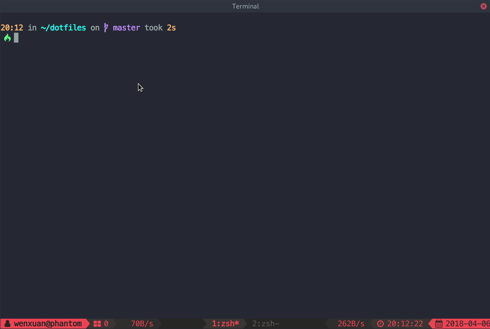

# tmux-fzf-url

`tmux-fzf-url` is a tmux plugin for opening urls from browser quickly without mouse.



## Install

Make sure you have [`fzf`](https://github.com/junegunn/fzf) installed.

### [TPM](https://github.com/tmux-plugins/tpm) (Recommend)

Add this line to your tmux config file, then hit `prefix + I`:

``` tmux
set -g @plugin 'wfxr/tmux-fzf-url'
```

### Manually

Clone this repo somewhere and source `fzf-url.tmux` at the config file.

## Usage

The default key-binding is `u`(of course prefix hit is needed), it can be modified by
setting value to `@fzf-url-bind` at the tmux config like this:

``` tmux
set -g @fzf-url-bind 'x'
```

## Tips

- Use `tab` to mark multiple urls and open them at once.
- Hit `ctrl - r` to toggle selection.
- The tmux theme showed at screenshot is [tmux-power](https://github.com/wfxr/tmux-power)(currently no `README` :sweat_smile:, will add sometime).

## License

[MIT](LICENSE.txt)
